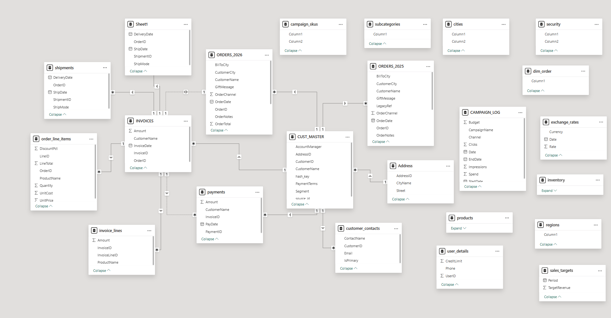
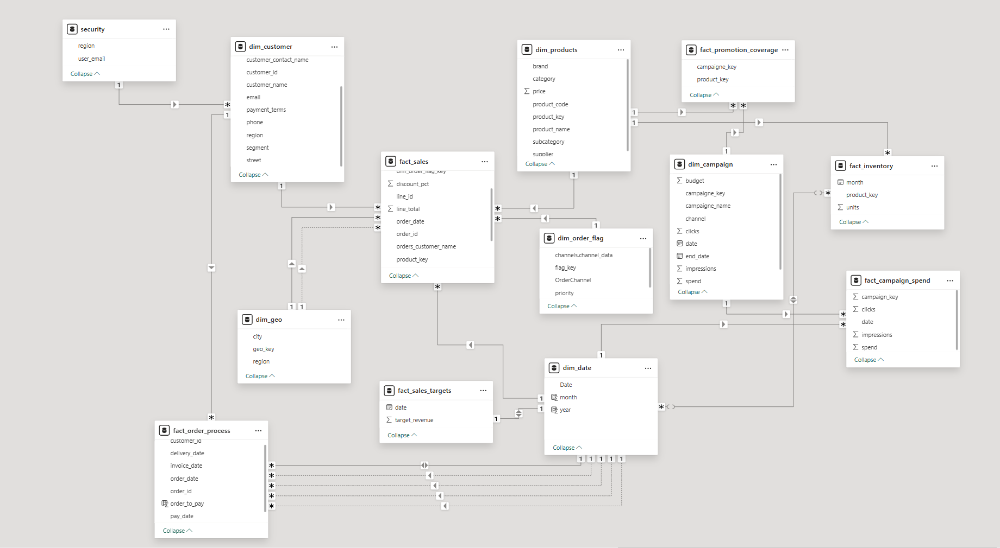

# 📊 Data Model Refactor: From Chaos to Star Schema

## 🧩 Problem

The company's data model had grown organically over the years — teams kept
adding tables "for now," copying spreadsheets year over year, and importing
data from different sources with no shared naming standard. The result?

- Duplicate tables for every single year (`ORDERS_2025`, `ORDERS_2026`)
- Inconsistent column naming (`CustomerID` vs `customer_id` vs `hash_key`)
- Empty, unidentified columns (`Column1`, `Column2`, ... `Column13`)
- No clear fact–dimension relationships (a star schema buried under a layer
  of accidental "many-to-many" connections and one-off sheets like `Sheet1`)
- Business logic scattered across `customer_contacts`, `CUST_MASTER`,
  `user_details`, and `security` — the same data living in four different
  places

The outcome: Power BI reports built slowly, relationships had to be
"guessed," and any new analyst needed half a day just to figure out what
connected to what.

## 🎯 Goal

Redesign the data model from scratch following **star schema** principles:
a clear split between fact and dimension tables, consistent naming, a
single source record for every business entity, and relationships that can
be understood at a glance.

## 🛠️ What I Did

This refactor is based on Kimball star schema modeling principles and on
the course **[Power BI Data Modeling Portfolio Project End-to-End
(Nightmare Data Model)](https://www.youtube.com/watch?v=0A2k62YEbfI)**,
which walks through exactly this kind of process — from diagnosing a
"nightmare" dataset to building a clean, report-ready model.

1. **Audit of the existing model** — mapped every table, column, and
   relationship from the original source (Power BI / Excel) to understand
   which data was actually being used, and which was duplicated junk.
2. **Consolidation of yearly tables** — merged `ORDERS_2025` and
   `ORDERS_2026` into a single fact table `fact_sales`, using `order_date`
   as a proper time dimension instead of a suffix in the table name,
   eliminating the yearly duplicates.
3. **Cleanup of dimensions** — merged fragmented customer tables
   (`customer_contacts`, `CUST_MASTER`, `user_details`) into a single
   `dim_customer` with full context (region, segment, contact details).
4. **Introduction of a naming standard** — the `fact_*` convention for
   transactional tables and `dim_*` for dimensions, with `snake_case`
   applied consistently across all columns.
5. **Proper key structure** — every fact table now connects to its
   dimensions through clearly named keys (`product_key`, `campaign_key`,
   `geo_key`) instead of default, ambiguous IDs.
6. **Splitting sales and marketing logic** into separate, related fact
   tables: `fact_sales`, `fact_sales_targets`, `fact_campaign_spend`,
   `fact_promotion_coverage`, `fact_inventory`, `fact_order_process`.
7. **Dedicated security layer** — extracted `security` as a standalone
   table controlling access at the region and user level (row-level
   security), connected directly to `dim_customer`. This was a key part
   of the redesign: instead of security logic being duplicated or
   half-implemented across multiple customer-related tables, access
   control now lives in one place with a single, auditable relationship
   to the customer dimension — making it clear exactly who can see what,
   and why.

## 📐 Model Structure (After Refactor)

**Dimension tables (dim_):**
- `dim_customer` — customer data (contact, region, segment)
- `dim_products` — product catalog (brand, category, price)
- `dim_geo` — location (city, region)
- `dim_date` — calendar (day, month, year)
- `dim_campaign` — marketing campaigns (budget, channel, reach)
- `dim_order_flag` — order flags and priorities

**Fact tables (fact_):**
- `fact_sales` — sales transactions (order lines, discounts, value)
- `fact_sales_targets` — revenue targets over time
- `fact_campaign_spend` — campaign spend and performance (clicks,
  impressions)
- `fact_promotion_coverage` — promotion coverage across
  products/campaigns
- `fact_inventory` — inventory levels over time
- `fact_order_process` — order lifecycle (delivery, payment, invoicing)

## 🧮 Measures (DAX)

On top of restructuring the tables, I added a dedicated `_measures` table
with ready-to-use DAX measures, so **anyone working on this project going
forward** doesn't have to rebuild basic KPIs from scratch for every new
report:

- `total_sales` — total sales value
- `total_order` — total number of orders
- `total_active_customers` — number of active customers
- `base_total_customers` — baseline customer count (reference point)
- `avg_order_to_pay` — average time from order to payment

This means anyone joining the project gets immediate access to
standardized, tested measures — with no risk of two people calculating
"sales" in two different, incompatible ways.

## ✨ Results

- **Single source of truth** for customer, product, and order — no more
  asking "which `CustomerID` is the right one?"
- **Clear relationships** — every line in the diagram has a defined
  direction and cardinality (1:N), with no default "connect everything to
  everything" joins
- **Faster reports** — fewer unnecessary joins and duplicated data sped
  up model refresh in Power BI
- **Scalability** — a new year of data is now a new row in `dim_date`,
  not a new table
- **Ready-made measures** — new analysts start with a working set of
  core KPIs, with no need to rebuild the logic from scratch
- **Centralized, auditable security** — row-level access control lives
  in one dedicated table connected to `dim_customer`, instead of being
  scattered or duplicated across the model

## 🧰 Tools Used

- Power BI (Model View / Power Query)
- Kimball star schema modeling principles

---

*Screenshots show the actual data model view before and after the
refactor in Power BI.*
